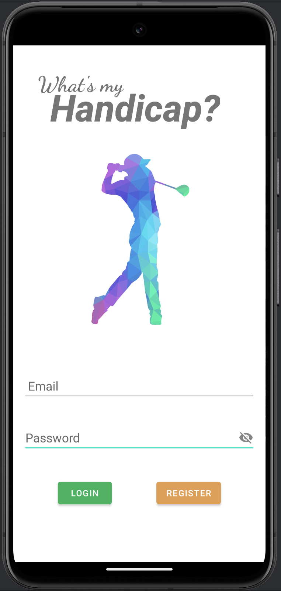
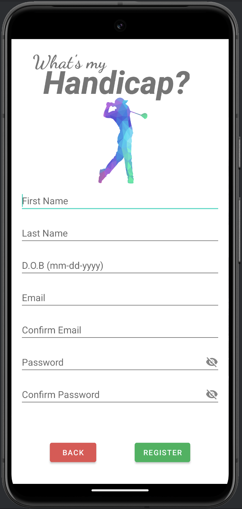
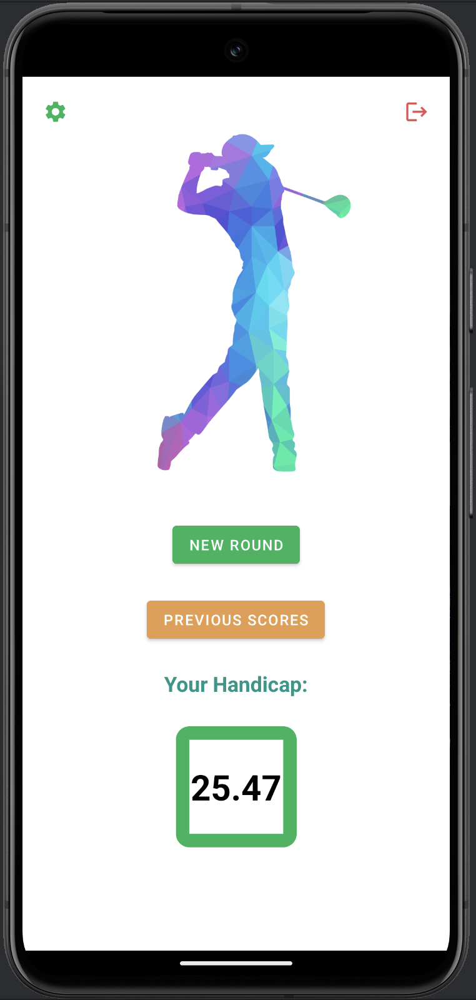
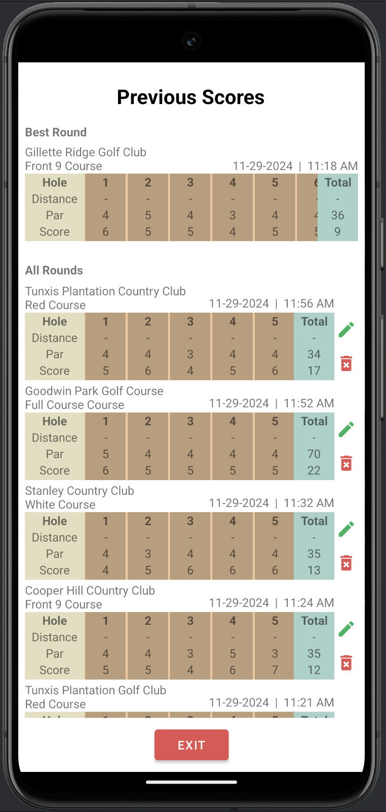
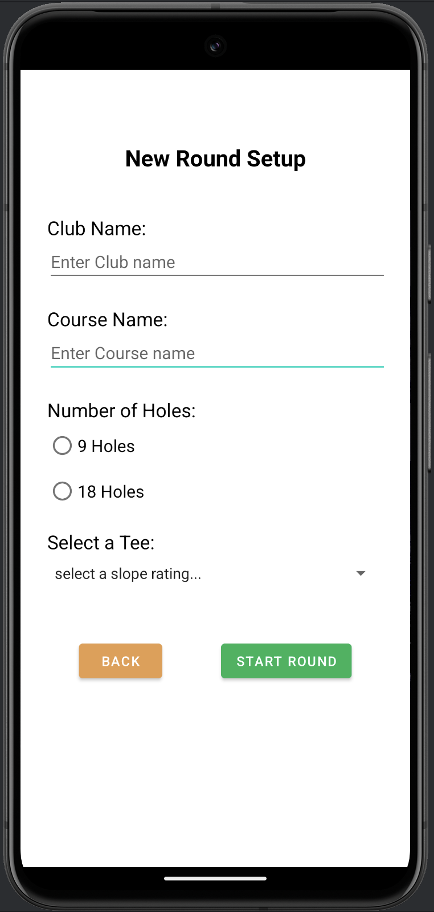
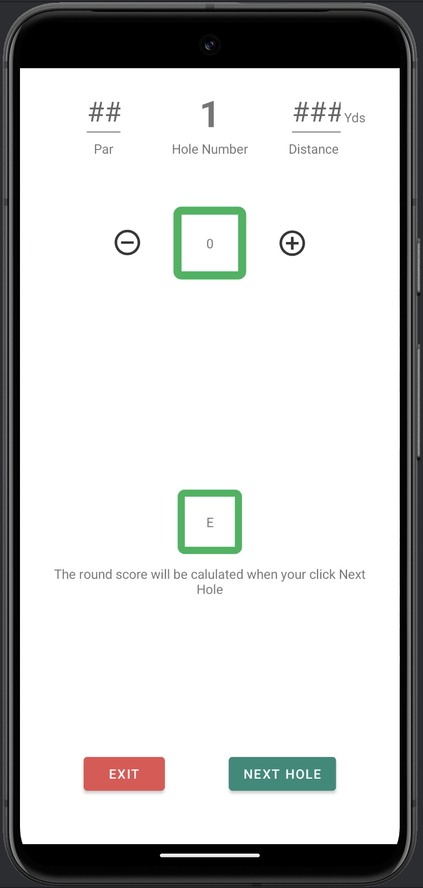

# What's My Handicap
&ndash; Shamal Siriwardana

## Problem:

As an amateur golfer who just starting playing about a year ago, 
I found myself if a simple issue: By the time I complete the hole, I had forgotten the
number of stoke I've taken to finish the hole. All the current consumer golf score keeping 
applications only allows the user to input the stroke count once the hole is completed.

## Solution: 

Create an application that allows me to increment the stroke count for each hole 
when the stroke is completed not when the hole is completed  

## Approach: 
- Create an application that allows the user to login and/or register
- Once logged in, the user can start a new round and keep track of the user's round data
- Once logged in, the user can also review the user's previous scores, 
edit and delete rounds if needed 
- With 8 or more rounds stored in the db, the application will calculate the user's Handicap

### Algorithm to calculate the Player Handicap

1. roundDifferential = ((adjustedGrossScore - courseRating) / slopeRating) * 113
2. Average the best 8 round Differentials
3. Handicap = 96% of the average round differential up to 2 decimal points 

## Application Overview: 
#### login and Registration screens
<table>
  <tr>
    <td></td>
    <td></td>
  </tr>
   <tr>
      <td align="center">Login Screen</td>
      <td align="center">Register Screen</td>
   </tr>
</table>

#### Home, Previous New Round, Hole Data screens

<table>
  <tr>
    <td></td>
    <td></td>
      </tr>
    <tr>
      <td align="center">Home Screen</td>
      <td align="center">Previous Scores Screen</td>
        
   </tr>
<tr>
<td></td>
    <td></td>

</tr>
<tr>
<td align="center">Setup new round screen</td>
      <td align="center">Hole data screen</td>
</tr>
</table>